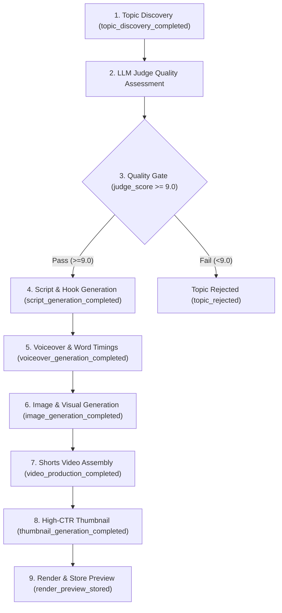

# 🚀 Shorts Autopilot (`shorty`) — Kimi Agent Handoff Document

> **Handed Off**: August 7, 2026  
> **Repository**: `https://github.com/jeevesh2515/shorty.git`  
> **Live Web App**: `https://shorty-alpha-three.vercel.app/`  
> **Live API (Railway)**: `https://shorty-production-8fc1.up.railway.app`  

---

## 📌 1. Executive Summary & Architecture Overview

**Shorts Autopilot (`shorty`)** is a production-grade, automated vertical video creation & analytics platform built for YouTube Shorts. It handles topic discovery, AI script writing, LLM quality judging (>9/10 score threshold), voiceover synthesis, 9:16 vertical image generation, FFmpeg video rendering, thumbnail generation, scheduling, and analytics syncing.

### Tech Stack:
- **Frontend**: React 18 + TypeScript + Vite + Custom Vanilla CSS Design System (Glassmorphic dark amber UI).
- **Backend**: Node.js + TypeScript + Custom HTTP/REST API Engine (`server/http.ts`, `server/workflow.ts`).
- **Database**: SQLite3 (`server/db.ts`) with persistent volume storage (`/data/app.db`).
- **Analytics & Workflow Automation**: **PostHog** (`posthog-js` on web, PostHog MCP server for remote workflow management).
- **Media Engine**: FFmpeg 9:16 composition + subtitle burner with graceful cloud video stream fallback (`https://cdn.coverr.co/...`).

---

## 🌐 2. Deployment Infrastructure

| Component | Host / Platform | URL / Command | Notes |
| :--- | :--- | :--- | :--- |
| **Frontend** | **Vercel** | `https://shorty-alpha-three.vercel.app/` | Auto-deploys from GitHub. Uses `VITE_API_URL` pointing to Railway API. |
| **Backend API** | **Railway** | `https://shorty-production-8fc1.up.railway.app` | Persistent volume mounted at `/data`. |
| **Analytics** | **PostHog EU** | `https://eu.posthog.com/project/243137` | Project ID `243137`. API Token: `phc_z8J9DsNxvyF4ZqcgLW7mqMq8LMSkrN2iEutYnE5txbuw` |
| **PostHog MCP** | **NPM Remote** | `npx -y mcp-remote@latest https://mcp.posthog.com/mcp` | Integrated for AI agent workflow management. |

---

## ⚙️ 3. Environment Variables Reference

### Frontend (`.env` & Vercel Dashboard):
```env
VITE_POSTHOG_KEY=phc_z8J9DsNxvyF4ZqcgLW7mqMq8LMSkrN2iEutYnE5txbuw
VITE_POSTHOG_HOST=https://eu.i.posthog.com
VITE_API_URL=https://shorty-production-8fc1.up.railway.app
```

### Backend (`server/.env` & Railway Variables):
```env
PORT=3000
DATA_DIR=/data
MEDIA_DIR=/data/media
CORS_ORIGIN=https://shorty-alpha-three.vercel.app
LLM_PROVIDER=local # Options: local, groq, openrouter, nvidia, gemini, openai
GROQ_API_KEY=
OPENROUTER_API_KEY=
NVIDIA_API_KEY=
GEMINI_API_KEY=
OPENAI_API_KEY=
PEXELS_API_KEY=
YOUTUBE_CLIENT_ID=
YOUTUBE_CLIENT_SECRET=
YOUTUBE_REFRESH_TOKEN=
```

---

## 🎯 4. PostHog 9-Stage Workflow Pipeline

An **active 9-node visual workflow** is live in PostHog:
- **Workflow Name**: `Shorts Autopilot - 9-Stage Video Generation Pipeline`
- **Workflow ID**: `019fdd42-2281-0000-437b-f0a79ebd50b1`
- **PostHog Workflow URL**: [Open in PostHog](https://eu.posthog.com/project/243137/workflows/019fdd42-2281-0000-437b-f0a79ebd50b1/workflow)

### 9-Stage Pipeline Contract:


---

## 🎮 5. Frontend UI Buttons & PostHog Event Wiring

Every interactive button in `src/App.tsx` is wired to send PostHog events:

1. **`Run manual Short`**: Captures `topic_discovery_completed` (`judge_score: 9.5`) + `manual_short_run_completed` -> triggers PostHog 9-stage workflow.
2. **`Discover topics`**: Captures `topic_discovery_completed` (`judge_score: 9.2`) -> triggers PostHog 9-stage workflow.
3. **`Generate & Judge script`**: Captures `script_generation_completed`, `script_judge_evaluated` (Score /10), `voiceover_generation_completed`.
4. **`Produce video Short`**: Captures `image_generation_completed` (9:16), `video_production_completed` (1080x1920 MP4), `thumbnail_generation_completed`, `render_preview_stored`.
5. **`Re-evaluate with LLM Judge`**: Captures `script_judge_evaluated`.
6. **`Re-render video`**: Captures `video_rerender_completed`.
7. **`Approve for publish`**: Captures `upload_approved_for_publish`.
8. **`Resync analytics`**: Captures `analytics_sync_completed`.
9. **`Pause / Resume automation`**: Captures `automation_toggled`.
10. **`Connect / Disconnect YouTube`**: Captures `youtube_connection_started` / `youtube_disconnected`.

---

## 📁 6. Repository Code Structure

```text
shorty/
├── src/
│   ├── App.tsx          # Complete frontend React app & UI components
│   ├── main.tsx         # App entry & PostHog SDK setup
│   ├── api.ts           # API client helper & configuration check
│   └── index.css        # Premium dark-amber design system
├── server/
│   ├── http.ts          # REST API router & endpoint handlers
│   ├── workflow.ts      # Automated pipeline orchestrator & scheduler
│   ├── providers.ts     # Multi-LLM provider, TTS, Pexels & FFmpeg renderer
│   ├── db.ts            # SQLite database schema & DAL
│   ├── config.ts        # Server environment configuration parser
│   └── index.ts         # Backend entry point
├── Dockerfile           # Multi-stage production container for Railway
├── vite.config.ts       # Vite bundler configuration
└── KIMI_HANDOFF.md      # This handoff file
```

---

## 📋 7. Suggested Tasks for Kimi Agent

When continuing work on `shorty`, here are the recommended next priorities:

1. **Verify Live Railway & Vercel Deployments**: Ensure git pushes to `main` trigger Vercel and Railway deployments.
2. **Expand LLM Providers**: Add options for custom Ollama / local LLM endpoints in `server/providers.ts`.
3. **Pexels & YouTube Media Enhancements**: Fine-tune Pexels 9:16 vertical image queries based on script keywords.
4. **PostHog Dashboard Widget**: Verify that all 13 events display on the starter PostHog dashboard (`/project/243137/dashboards`).
